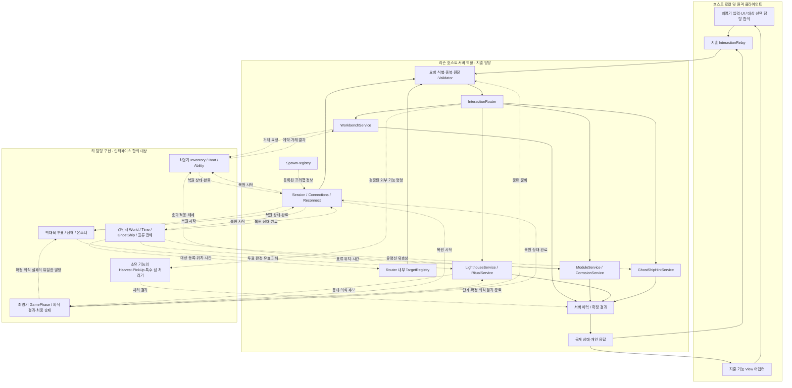
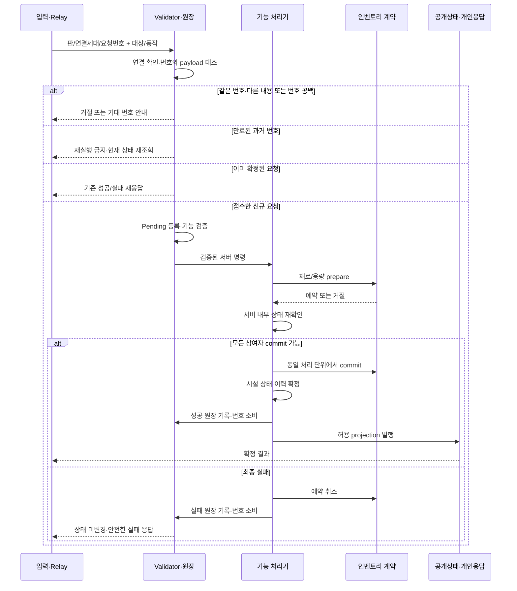
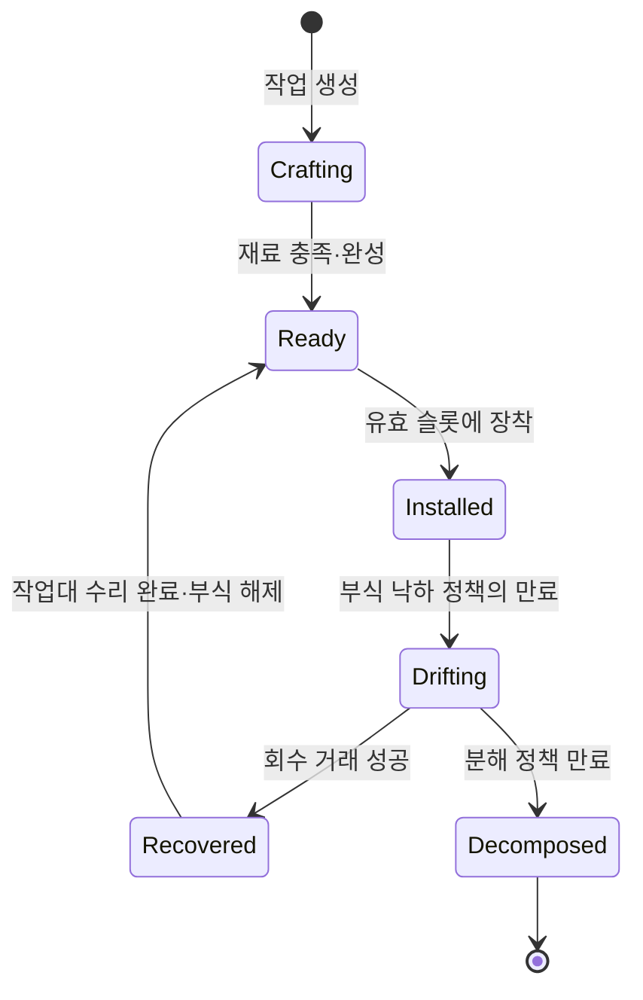

# 김지훈 담당 시스템 설계와 아키텍처

기준일: 2026-10-10. 담당: 김지훈(`zhun0922`). 상태: **설계 제안·게임 코드 미구현**. 이 문서는 JH01~JH08의 구현 구조를 구체화한다. 새 타입·메서드 이름은 제안이며 현재 존재하는 API가 아니다. 게임 규칙의 미정을 해소하거나 다른 담당자의 구현을 승인하지 않는다.

## 1. 범위와 근거

[담당표](../CODE_OWNERSHIP.md), [v4 기획](references/game-design-v4.md)의 4.5·4.7·4.8·6·7·8.3·12.1, [기술설계](../03-technical-design.md), [네트워크 권위](../unity/NETWORK_AUTHORITY.md)를 따른다. 기획 충돌은 최신 사용자 결정과 v4를 우선한다. 작업 ID는 [담당 작업표](../06-owner-work-plan.md), 미결 ID는 [설계 문제 대장](../07-design-issue-register.md)과 연결된다.

| 지훈 책임 | 포함 | 경계 밖에서 받거나 제공할 것 |
|---|---|---|
| JH01·07 Network | 세션 연결·로비 네트워크 흐름·스폰 프리팹 등록·연결 조회·재접속 조율 | 플레이어 생성 연결은 최명기와 계약하고 나머지 도메인 스폰은 각 담당자. 게임 시작·승패는 최명기 |
| JH02 Interaction | Relay·Router·Validator·기록·실패 응답 | 대상 선택 입력의 담당은 최명기와 지훈 중 합의 필요. 채집·특수 섬 등의 실제 판정은 소유 기능 |
| JH03~05 Lighthouse | 작업대·모듈·부식·낙하/회수/수리·등대 상태·의식 처리 | 인벤토리·배 효과는 최명기, 파도/판정 위치는 강민서, 투표·심해는 박태욱 |
| JH06 GhostShipHints | 조사 검증·힌트 생성·개인 전달·이력 | 등장·경로·존재 구간·관찰 가능성은 강민서 |
| JH08 안정화 | 4인 통합 절차·증거·결함 분배 | 각 담당자의 기능 시험·씬 수정 책임 유지 |

UI 화면·직군 능력·투표 계산·몬스터 AI·월드 생성·게임 최종 승패는 설계 대상이 아니다. 이들에는 필요한 입력/출력 계약만 제안한다. 공용 계약은 지훈이 조율하지만 타 담당 코드를 대신 소유하지 않는다. 인게임 보이스·무전은 포함하지 않는다.

## 2. 확인된 현재 상태와 공백

검색 범위는 `Assets/01.Scripts/`와 설치된 `Assets/Mirror/Core/NetworkManager.cs`다. 폴더가 있다는 이유로 실행부가 있다고 보지 않는다.

| 근거 | 확인 내용 | 설계에 미치는 영향 |
|---|---|---|
| `03.Interaction/Requests/Net/InteractionRequest.cs` | readonly 구조체, ActorId·TargetId·Action·Arg0·Arg1·ServerTime | 송신자 증명·요청 고유 ID·응답·재전송 처리 없음. 그대로 신뢰 가능한 서버 명령으로 사용 불가 |
| 같은 폴더 `InteractionAction.cs` | Harvest~InspectGhostShip 9종 + None | 부식·검사·점화 등은 열거형에 없음. 추가 동작은 별도 계약 변경 필요 |
| `05.Player/Control/PlayerController.cs` | InteractionRequested 이벤트 선언·발행만 검색됨 | 대상 선택→요청 생성 소비자 연결 필요. 최명기 영역 파일은 이번에 수정하지 않음 |
| `01.Network/`, `04.Lighthouse/` | 현재 검색에서 자체 C# 실행부 미확인 | 아래 NetworkManager·거래·등대 타입은 신규 구현 계획 |
| Mirror NetworkManager | 연결·Ready·AddPlayer·Disconnect 콜백 존재. 기본 Disconnect는 플레이어/소유 객체 파괴 | 게임 준비와 transport ready 분리, 보존/재결합 경로 필요 |
| World 기존 식별자 | SpotInfo.SpotId는 int, IslandHandle.Index는 short, 요청 TargetId는 uint | 단순 캐스팅 대신 registry 매핑 필요 |

현재 namespace `Lighthouse.Map.Net.Contracts`는 위치만 보고 바꾸지 않는다. 새 전송 DTO를 추가할 때 기존 구조체와 변환 경계를 둔다. readonly 구조체의 Mirror 직렬화 가능성은 지정 Unity 버전에서 Weaver 및 왕복 테스트로 검증해야 하며 문서로 통과를 가정하지 않는다.

## 3. 전체 구조도

실선은 내부 요청·반영 경로, 점선은 타 담당과 합의할 데이터/요청 흐름이다. 화살표는 송신자에서 수신자로 향한다. 서버 상자는 **일반 게임 빌드 안의 리슨 호스트 서버 역할**이며 별도 전용 서버가 아니다. 호스트 로컬 플레이어도 동일 요청 경로를 탄다.



History는 상태 원본을 대신하는 이벤트 소싱 저장소가 아니다. 상태 변경과 같은 서버 처리 단위에서 결과·이력을 확정한 뒤 공개/개인 projection을 발행한다. 외부 DB나 영구 저장은 이 설계에 포함하지 않는다.

## 4. 코드 배치와 책임

모두 기존 `Lighthouse.Runtime` 아래다. 아래는 예정 배치이며 비어 있는 모든 층을 먼저 생성하지 않는다.

```text
Assets/01.Scripts/
  01.Network/
    Session/{Net,Server}/           LighthouseNetworkManager, SessionCoordinator
    Connections/Server/             ConnectionDirectory
    SpawnRegistry/{Rules,Server}/   NetworkPrefabCatalog, SpawnRegistration
    Reconnect/{Rules,Server,Net}/    ReconnectCoordinator, SnapshotEnvelope
  03.Interaction/
    Requests/{Rules,Net}/           wire DTO, 검증된 서버 명령, 결과 코드
    Relay/{Net,View}/               InteractionRelay, InteractionInputAdapter
    Router/Server/                 InteractionRouter, TargetRegistry
    Validator/Server/              RequestValidator, RequestLedger
    History/Server/                InteractionHistory
    GhostShipHints/{Rules,Server,Net,View}/
  04.Lighthouse/
    Workbench/{Rules,Server,Net,View}/
    Modules/{Rules,Server,Net,View}/
    Corrosion/{Rules,Server,Net,View}/
    Lighthouse/{Rules,Server,Net,View}/
```

`Rules`: 정책 입력·불변식·순수 계산. `Server`: 권위 상태와 거래. `Net`: Mirror 직렬화·전송·허용된 projection. `View`: 선택/진행/실패 표시를 UI에 전달하는 기능 어댑터. 전체 UI 화면 소유는 최명기다. 신규 namespace는 기존 컨벤션의 `Lighthouse.{도메인}.{기능}[.{층}]`을 따른다.

공용 타입은 첫 구현부터 `00.Common`에 몰지 않는다. 기능 고유 계약은 생산자 기능에 두고 여러 소비자가 실제로 공유할 때 위치를 합의한다. 하나의 asmdef이므로 폴더 의존은 컴파일러가 강제하지 않는다. 코드 리뷰에서 역참조와 타 기능 상태 직접 수정을 검사한다.

## 5. 요청·검증·응답 계약

### 5.1 식별과 전송

| 필드/식별자(제안) | 용도·신뢰 경계 |
|---|---|
| MatchId | 서버가 발급한 판 식별. 이전 판 패킷 차단 |
| ActorId | 판 안에서 유지하는 주체 ID. 서버 ConnectionDirectory가 연결에서 도출. 클라이언트 값은 주장일 뿐 |
| ConnectionEpoch | 연결이 교체될 때 서버가 갱신하는 세대. 끊긴 소켓의 늦은 요청 차단 |
| RequestSequence | ActorId별 단조 증가 요청 번호. 재접속 때 원장과 다음 번호 복원 |
| TargetId + Generation | 등록된 대상과 재사용 세대. Mirror netId와 도메인 ID를 혼용하지 않음 |
| Action + 타입별 payload | 허용 동작·개수·슬롯·레시피 ID. Arg0/Arg1의 의미를 라우트별로 고정하고 범위 검사 |
| ExpectedRevision | 필요할 때 해당 수신자가 볼 수 있는 PublicRevision 비교. 비밀 상태 변경으로 stale 여부를 드러내지 않음 |
| ReceivedAt / CommittedAt | 서버가 생성. 기존 ServerTime 필드를 클라이언트 시간 근거로 신뢰하지 않음 |

전송 DTO에는 서버가 작성할 시각과 확정 결과를 넣지 않는다. 서버가 검증된 내부 명령을 만들며 기존 InteractionRequest를 계속 쓸지는 소비자 정리 시 결정한다. 기존 enum 값은 재번호화하지 않는다. 부식/검사/점화 추가는 각 액션의 payload·권한·오류·수신자 계약과 함께 한다.

TargetRegistry는 `(DomainKind, 기존 식별자, 생성 세대)`를 서버 발급 uint TargetId와 Generation에 매핑한다. 음수/short를 uint로 단순 캐스팅하지 않는다. 등록 해제 후 같은 ID가 재사용돼도 Generation을 바꾸고 같은 판에서 과거 쌍은 무효로 둔다. World의 SpotInfo/IslandHandle 타입은 수정하지 않는 adapter를 둔다. 클라이언트에는 허용된 대상의 핸들만 제공한다. Harvest·PickUp·UseSpecialIsland는 Router에서 각 기능 담당의 handler로 전달하며 지훈 Validator가 그 기능의 경제·횟수 규칙을 대신 소유하지 않는다.

기본 전송안은 소유 플레이어의 NetworkBehaviour에 있는 `[Command]` Relay다. 서버는 실제 연결과 소유 객체를 확인한다. 월드 객체를 클릭했다는 이유로 그 객체의 authority를 넘기지 않는다. 호스트 로컬 입력도 서버 서비스에 직접 우회 호출하지 않는다.

### 5.2 처리 순서

1. 연결이 현재 세대이며 인증·복원·게임 준비를 마쳤는지 확인한다. 실제 인증/재접속 증명 방식은 §8의 합의 대상이다.
2. 메시지 크기·해석 가능한 형식·요청 속도 제한을 검사한다. 여기서는 접수 가능 여부만 판단한다. 해석 가능한 Action/수량의 의미 검증은 번호 접수 뒤 수행해 최종 실패도 원장에 남긴다.
3. 판·주체·요청 번호를 검증하고 중복 결과를 조회한다. 동일 번호와 다른 payload는 거부한다. 이전 연결의 재시도는 현재 연결로만 허용하며 주체는 동일해야 한다.
4. TargetId/Generation·생존·지원 동작·서버 판정 위치를 확인한다. 거리·시야·행동 상태는 액션마다 적용한다. 비밀 투표 등 다른 기능에 공통 거리 검사를 강제하지 않는다.
5. 기능 Validator가 허용 Action·권한·역할·현재 단계·용량·재료·횟수·쿨다운을 확인한다. 수량은 양수 및 상한 이내이며 누적 산술의 overflow도 거부한다. 처리 대기 후 commit 직전에 다시 읽는다.
6. 같은 서버 상태 변경 단위에서 거래를 확정하고 revision·결과 원장·이력을 갱신한다. 이후 개인 응답과 공개 상태를 보낸다.

클라이언트에는 성공 여부·안전한 오류 코드·RequestSequence·자신에게 허용된 revision을 반환한다. 검증된 자기 연결에는 RequestDisposition과 NextExpectedSequence도 반환해 번호 소비 여부를 모호하게 하지 않는다. 미인증/잘못된 판 요청에는 주체 원장의 기대 번호를 노출하지 않는다. 서버 전용 실패 이유/역할/부식 여부는 일반 오류 메시지로 누출하지 않는다. `Unavailable`, `InvalidRequest`, `OutOfRange`, `Busy`, `StaleState`, `NotEnoughResource`, `CapacityExceeded`, `PolicyNotConfigured` 등은 제안이며 사용 범위와 노출 수준을 라우트별로 확인한다.

공개 버전 PublicRevision, 서버 내부 변경 버전 ServerRevision, 개인 결과 버전을 분리한다. 부식 표식·검사는 공개 필드/공개 버전/클라이언트 ExpectedRevision에 영향을 주지 않는다. 서버 내부 거래는 ServerRevision을 재검사하되 비밀 변경만으로 StaleState를 외부에 보내지 않고 최신 상태에서 공개적으로 같은 요청을 재판정한다. payload fingerprint에는 동작·대상·수량 등 요청 의미만 넣고 재접속 ConnectionEpoch 같은 전송 메타데이터는 제외한다.

중복 키는 `(MatchId, ActorId, RequestSequence)`다. 연결 세대는 replay 허용 검증에 쓰되 중복 키에 넣어 재접속마다 새 거래가 되게 하지 않는다. 클라이언트는 상태 변경 요청을 한 번에 하나씩 보내는 초기안을 사용하고 미응답 재전송에는 같은 번호/내용을 쓴다. 서버는 마지막 처리 번호와 일정 범위 결과를 유지한다. 캐시에서 사라진 오래된 번호도 재실행하지 않고 상태 재조회 응답을 준다. 만료 범위·요청 제한값은 측정 후 설정하며 무제한 원장·큐를 만들지 않는다. 재전송 실패 시 새 번호로 자동 재실행하지 않는다.

순서 계약은 다음과 같다. 주체/판을 신뢰할 수 없는 메시지·크기 위반은 입장 전 거절로 원장에 넣지 않는다. 신뢰된 주체의 다음 번호 N만 신규로 접수한다. N보다 크면 SequenceGap과 기대 번호를 돌려주고 번호를 소비하지 않는다. N을 접수한 뒤 권한·거리·수량·용량 등 기능 판정이 끝나면 **성공과 최종 실패 모두** 원장에 기록하고 다음 번호로 진행한다. 처리 중 같은 N은 Pending으로 응답하고 재실행하지 않는다. Ready 이전/속도 제한 같은 일시 거절은 접수 전에만 하며 번호를 소비하지 않는다. 원장 캐시 만료 번호는 결과 미확인과 현재 상태 조회를 돌려주되 재실행하지 않는다. 입력 변경 후 새 번호로 다시 시도하는 것은 사용자의 새 동작이다. 검사 능력도 Relay의 같은 키로 진입하고 최명기 Ability는 그 거래 키를 사용해 권리를 한 번만 소비한다. 별도 Ability 경로가 있으면 동일 원장 계약을 따르기 전까지 중복 진입을 연결하지 않는다.

| 요청 분류 | 번호·응답 계약 |
|---|---|
| 주체/판 불신, 해석 불가 메시지 | 미접수·번호 미소비, 안전한 일반 거절. 타인/과거 판의 기대 번호 제공 안 함 |
| 확인된 연결의 준비 전·속도 제한·번호 공백 | Unaccepted, 미소비, 자기 NextExpectedSequence 제공 |
| 다음 번호 N의 해석 가능한 잘못된 Action·수량 0/음수/초과 | 접수 후 최종 실패 기록, Final·소비, 다음 번호 N+1 |
| 유효 요청의 처리 중 중복 | Pending, 미완료, N을 유지하고 같은 내용으로만 조회/재시도 |
| 최종 성공/실패 중복 | Final, 이미 소비한 결과 재응답. 현재 NextExpectedSequence 제공 |
| 결과 캐시에서 빠진 과거 번호 | Expired, 이미 처리한 번호로 재실행 불가. 현재 상태/기대 번호 조회 |
| 같은 번호·다른 payload | 변경 요청을 접수하지 않음. 원래 요청의 Pending/Final/Expired 상태와 자기 기대 번호만 안내 |

수신 측은 오류 코드 이름만 보고 번호 소비 여부를 추론하지 않는다. 수정한 payload는 원래 요청이 최종 처리됐음을 확인한 뒤 새 동작으로만 제출한다. 형식 오류가 있어 ActorId/요청 번호를 안전하게 해석할 수 없으면 일반 거절 후 자기 원장을 재조회한다.



## 6. 작업대·모듈·부식

지속/독점 행동을 연결할 때는 Begin/Cancel/Complete와 InteractionSessionId의 계약을 해당 담당자와 정한다. 서버가 점유·만료를 소유하고 이탈·대상 소멸·단계 전환·시간 초과에 해제한다. 작업대 메뉴 열기가 독점 점유를 뜻한다고 가정하지 않으며, 단발 투입/인출과 지속 행동을 분리한다.

### 6.1 자원 거래

작업대별 상태: WorkOrderId, RecipeId/Version, 필요량/투입량, 제작 상태, 출력 ModuleInstanceId, PublicRevision/ServerRevision. 레시피 변경 중인 거래는 기존 RecipeVersion에 묶는다. 제작 슬롯·동시 작업 수·레시피 선택/변경 시 환불은 결정 목록에 둔다.

투입·인출·수리 비용·회수는 인벤토리 소유자 최명기와 **prepare/commit/abort** 계약을 맞춘다. 서버 메인 실행 흐름에서 모든 참여자의 자원·용량을 예약하고, 상태 재검사 후 await/yield 없이 함께 반영하는 초기안이다. prepare 중에는 복제·소비·이벤트를 발생시키지 않는다. commit은 사전 검증 뒤 실패하지 않는 작은 메모리 변경으로 제한하고, 참여자 구현이 이를 보장하지 못하면 통합하지 않는다. 예외 발생 시 부분 상태로 계속 실행하지 않고 해당 거래 경로를 차단·진단한다. 프로세스 크래시까지 복구하는 영구 거래 보장은 하지 않는다.

- 투입 성공: 개인 재료 감소와 작업대 투입 증가가 같은 거래다.
- 인출 성공: 작업대 감소와 승인된 수신 인벤토리 증가가 같은 거래다. 반환 귀속은 미정이다.
- 마지막 재료 충족: 소비 전환과 완성 모듈 생성이 한 번만 발생한다. 제작 완료와 인출은 같은 작업대 변경 순서에서 직렬화한다.
- 회수 성공: 바다 모듈 상태 해제와 승인된 보관 위치 등록이 함께 일어난다. 인벤토리에 모듈을 넣는 방식/용량은 최명기와 합의 전까지 adapter 계약이다.
- 실패: 소비·복제·부분 투입이 없다. `수량=0/음수/overflow`, 용량 부족, 대상 소멸, stale revision을 검증한다.

일반 자원 경합은 서버 처리 순서로 직렬화하는 기술안이다. **같은 틱의 승패 우선순위는 이 큐 순서로 결정하지 않는다**(§7). 거래 간 자원 합계는 보유+투입+승인된 소비/생성/분해를 포함한 수지로 검증한다.

### 6.2 모듈 수명

ModuleInstanceId는 제작 시작부터 유지한다. 공개 위치/장착과 서버 비밀 부식 상태를 분리한다. 한 ID는 한 위치 상태만 가진다.



이 도식은 v4에 있는 주 경로다. v4 6장에 따라 **등대에 장착된 모든 모듈은 수동 제거 불가**다. 배 모듈 제거, 제작 취소, 장착 전 정화·폐기·재드롭은 정책 합의 전 명령을 미설정 상태로 두며 영구 금지 규칙으로 확정하지 않는다.

부식 표식은 Crafting 또는 Ready인 **등대용 모듈**에만 적용하고 제작 완료 후 동일 ID로 이어진다. 한 판 1회 소모와 표식 변경을 같은 처리 단위에서 확정한다. 역할·숨은 단계 자격은 타 담당의 서버 계약으로 확인한다. 검사 스킬의 하루 횟수 소모는 최명기 Ability가 소유하며 검사와 사용권 소모가 분리 성공하지 않도록 거래 계약을 맞춘다. 실패 시 사용권 소비 규칙·검사 허용 상태는 결정 대기다.

장착된 부식 모듈은 낙하 전 수동 제거 불가다. 장착 시 서버 정책이 낙하 시각/조건을 정하고 재접속으로 타이머를 리셋하지 않는다. 시각은 서버 기준이며 표시용 카운트다운과 권위 판정을 분리한다. 낙하시 슬롯 해제·효과 해제·표류 객체 전환을 한 사건으로 처리한다. 배 효과는 ModuleInstanceId/Revision으로 최명기 쪽에서 중복 적용을 막는다.

표류 모듈의 생성/회수/분해 수명은 지훈, 파도·해역 경계·판정 위치 제공은 강민서와 계약한다. 바다 연출 위치만으로 회수 거리를 판정하지 않는다. 난파 및 인벤토리에서 떨어질 화물 결정은 최명기와 연결하고, 표류 잔해 객체·동기화는 v4 12.1의 World 범위(강민서)로 대조해 세부 경계를 합의한다. 같은 모듈 처리기로 전체 난파 화물 소유권을 합치지 않는다. 공통 픽업 계약이 필요하면 따로 조율한다.

## 7. 등대·의식과 최종 승패 경계

등대 상태는 RepairProgress, CurrentHp, MaxHp, InstalledSlots, RitualAttemptId/State, Revision을 분리한다. 수리도→최대 HP 함수, 초기 HP, 수리 비용·회복량, 임계 보상 유지/해제는 설정 정책이며 미정 수치를 기본값으로 확정하지 않는다. 보상 효과 적용은 최명기 계약을 통해 instance/revision 기준으로 한 번 반영한다.

의식 상태의 기술안은 `Idle → Running → ResolutionPending → Resolved`다. 지훈의 Resolved는 **최명기 Systems가 확정한 의식 결과를 수신한 상태**이며 독립 판정이 아니다. 성공/실패만 확정 결과로 소비하고, 취소는 R07/R08 합의 전 사용하지 않는 자리표시다. 새 시도는 정책이 허용할 때 새 AttemptId를 발급한다. 60초는 v4에 제시된 값이지만 고정 상수가 아니라 설정값으로 관리한다. 시작 주체·조건·투표 평가 시점·중단/재시도 규칙은 R06/R07/W01의 결정 없이는 완성되지 않는다.

| 입력/출력 계약(제안) | 책임 |
|---|---|
| PhaseContext(version, phase, deadline) | 최명기 Systems가 제공. 지훈이 게임 단계를 별도로 소유하지 않음 |
| EvaluateRitualVotes(attemptId, policyMoment) | 박태욱이 서버에서 자격 계산. 표 대상/진영 목록 대신 필요한 판정 결과만 서버 처리기로 전달 |
| DamageLighthouse(eventId, amount, tick) | 박태욱 몬스터 서버가 유효 공격을 보냄. 지훈이 HP 변경·중복 피해 제거 |
| RitualResolutionCandidate(attemptId, tick, revision, result) | 지훈이 최명기 최종 판정기에 전달. 시민 승리 UI를 직접 실행하지 않음 |
| LighthouseDestroyed(eventId, tick, revision) | 지훈이 파괴 사실을 최명기에 전달. 마피아 승리를 직접 확정하지 않음 |
| RitualOutcomeCommitted(attemptId, outcome) | 최명기가 유일하게 발행하고 지훈·박태욱이 수신한다. 지훈은 의식 상태만 갱신, 박태욱은 같은 AttemptId의 확정 실패를 한 번 반영. 지훈이 게이지 이벤트를 재발행하지 않음 |

동일 틱의 점화·기한·HP0·소환·모듈 낙하는 후보를 모아 합의된 판정 경계에서 처리한다. **타 담당에게 단순 이벤트를 먼저 보내는 순서로 승자를 확정하지 않는다.** 최명기에게 필요한 계약은 판정 tick 마감, 우선순위 정책, 한 번의 GameEnded 발행이다. 여기서는 우선순위 자체를 정하지 않는다. 판정 경계 확정 전에는 관련 통합 승패 구현을 완료로 표시하지 않는다.

최후 전투 진입에서 기존 의식/수리도/모듈/타이머 승계는 R08/W01 결정이 필요하다. 최후 전투 점화에 비밀 투표 조건은 적용하지 않는다. 등대와 의식 정책은 해당 단계 버전을 확인하고, 이미 종료된 판의 지연 요청·타이머·피해를 무시한다. 방해 성공이나 난파로 심해 게이지를 올리지 않는다.

## 8. 접속·스폰·재접속

NetworkManager는 연결 콜백과 프리팹 등록 진입점, ConnectionDirectory는 연결↔ActorId↔플레이어 객체의 현재 세대 매핑만 소유한다. 도메인 객체 스폰 시점은 소유 기능이 결정한다. 공용 등록부는 누락/중복 프리팹을 확인하며 모든 기능을 직접 스폰하지 않는다.

### 8.1 로비와 플레이어 객체 생성

로비의 호스트 시작·참가 요청·정원 4명·연결/준비 상태 집계는 지훈, 버튼/화면은 최명기다. 사용자가 선택한 접속 방식의 진입점을 연결한다. 판 시작 전 4명의 승인된 슬롯·호환 빌드·월드 준비를 확인하고 시작 가능 상태를 Systems에 전달한다. 시작 후 새 참가 허용 여부는 N13 정책이며 자동 허용/거절로 확정하지 않는다.

본편 플레이어 프리팹·NetworkIdentity 및 PlayerController 연결은 최명기와 합의한다. 지훈은 자신의 InteractionRelay 컴포넌트와 등록/AddPlayer 경로를 제공한다. 프리팹에 Relay를 붙이는 수정은 최명기 영역 안내·합의 대상이다. IdentityValidated 뒤 OnServerAddPlayer 경로에서 플레이어 한 개만 생성/연결하고, ActorId 매핑·소유권 설정을 완료한 뒤 Systems의 직군/역할 초기화와 준비 확인을 거친다. 복귀자는 새 역할 배정/새 플레이어 생성을 타지 않는다.

A단계에서 본편 플레이어가 준비되지 않았다면 `99.Dev`의 시험용 NetworkIdentity+Relay 플레이어와 테스트 진입 씬을 별도 범위로 구현한다. 지훈의 테스트 쓰기 범위를 배타적으로 배정하고 자신의 Jihun 개발 씬만 수정한다. 이는 본편 Player 연결 완료가 아니며 최명기의 프리팹 연동 검증을 별도로 남긴다. 이번 문서 작업에서는 시험 코드/씬도 만들지 않는다.

### 8.2 해제·보존·재결합

설치된 Mirror의 기본 `OnServerDisconnect`는 `DestroyPlayerForConnection`으로 연결 소유 객체를 파괴한다. 재접속 지원 경로에서는 기본 호출 전에 ActorId 슬롯을 이탈 상태로 바꾸고 연결 권한을 차단한 뒤, 보존할 플레이어와 배/시설 점유를 소유 기능과 분리한다. 상태 원본과 RequestLedger는 연결 객체 바깥의 판 단위 저장소에 둔다.

Mirror 96.0.1 소스에 있는 `RemovePlayerForConnection(conn, RemovePlayerOptions.KeepActive)`는 플레이어를 남기고 연결을 해제하는 후보 수단이다. 다른 소유 객체도 기능별로 권한 회수/보존/파괴 목록을 적용한다. 기본 파괴에 맡겨 보존 객체까지 없애지 않는다. 복귀 연결에 플레이어가 없으면 `AddPlayerForConnection`, 임시 플레이어가 있으면 `ReplacePlayerForConnection`을 검토해 기존 객체를 한 번만 재결합한다. 이 API 호출 순서·관찰자 재등록·호스트 동작은 구현 시 Unity에서 검증하며 소스 존재를 런타임 통과로 보지 않는다.

유예 만료 때 객체를 어떻게 처리하는지는 게임 정책이지만, 유예 중 상태를 의도치 않게 파괴하지 않는 것은 기술 불변식이다. 재접속을 지원하지 않는 운영안이면 기본 파괴와 판 종료 정책을 명시적으로 결정해야 한다.

### 8.3 준비와 상태 복원

기술 흐름 제안: `TransportConnected → IdentityValidated → StateRestoring → GameplayReady`. Mirror ready는 객체 동기화 준비를 뜻하며 GameplayReady와 같다고 보지 않는다. 실제 네트워크 전송·관찰 준비 후 snapshot을 전달하고, 모든 필수 복원 완료 및 서버 확인 뒤 행동 입력을 연다. 초기 4인 준비와 월드 생성 완료를 모아 최명기 Systems에 전달하며, 시계 시작은 Systems/World 계약에 맡긴다.

재접속은 **같은 호스트 프로세스에 살아 있는 같은 판**의 상태를 다시 연결하는 구조다. 호스트 이전·크래시 복원·백엔드 계정 시스템을 내장 범위로 가정하지 않는다.

1. 서버가 검증할 복귀 증명과 ActorId를 매핑한다. connectionId/netId/클라이언트가 주장한 ActorId만으로 동일인을 인정하지 않는다. 판 한정 고엔트로피 복귀 토큰은 후보안이며 전달 채널·보관·만료·재발급·중복 연결 정책은 합의 대상이다. 로그나 공유 문서에 실제 토큰을 남기지 않는다.
2. 허용된 복귀라면 이전 연결의 권한을 폐기하고 ConnectionEpoch를 갱신한다. 중복 연결의 교체/거절 선택은 정책으로 받는다.
3. capture 경계는 **서버 갱신의 합의된 시점에서 한 프레임 안에 await/yield 없이 상태를 복사하는 것**이다. 클라이언트 전송/ACK를 기다리며 다른 세 플레이어나 서버 시계를 정지하지 않는다. 복사 후 갱신은 계속하고 필요한 변경분을 버전별로 버퍼링한다. 프레임 예산을 넘으면 무한 정지 대신 복원 실패/재시도로 처리하며 예산은 측정해 정한다. 호출 시점과 도메인 참여는 전 담당 계약이다.
4. 공개 네트워크 객체는 Mirror 초기 동기화+변경 상태를 우선 사용한다. 별도 SnapshotEnvelope는 개인/비공개 상태, 비네트워크 판 상태 및 공개 상태의 준비 버전 확인에 한정한다. 같은 공개 필드를 SyncVar와 별도 snapshot이 각각 덮어쓰게 하지 않는다. 각 소유자가 공개 baseline 적용 여부를 revision으로 확인하고 이후 변경을 합친다. World·시설/모듈·인벤토리/직군/게임 단계·투표/심해는 **각 소유자가 수신자별로 걸러서** 전달하며 공용 Coordinator가 비밀을 전체 공개 DTO로 합치지 않는다.
5. 초기 snapshot 적용 뒤 이후 revision 변경분을 반영한다. 누락/역순이면 재조회하며, 클라이언트 ACK는 실제 적용 확인에만 쓰고 권위 값을 신뢰하지 않는다. 서버가 준비 조건을 확인하면 입력을 연다.
6. 재접속은 기존 결과 원장·타이머·소모 횟수를 유지한다. 과거 소비/보상 이벤트를 재실행하지 않고 현재 상태를 복원한다. 복원 중 큐 상한·시간 초과 시 입력을 잠근 채 취소/재시도 정책을 따른다.

유예 시간, 이탈 중 배/몸 상태, 중도 새 참가, 호스트 이탈의 무효/기권/종료 처리, 접속 방식(LAN/인터넷)은 §11에서 결정한다. 미정 정책 때문에 독립적인 ConnectionDirectory/복원 인터페이스 설계까지 막지는 않는다. 어떤 정책도 기본값으로 사용자에게 숨겨 적용하지 않는다.

## 9. 힌트·기록·공개 정보

GhostShipHintService는 서버에서 World의 유효 유령선 ID/Generation·조사 가능 구간·판정 위치를 확인한다. 활성 대상만 서버 Router에 등록하고 소멸 시 해제한다. 동일 요청 재전송은 같은 힌트 결과를 반환한다. 별도 요청 번호로 재조사했을 때 새 힌트를 주는지/기존 결과를 재열람하는지는 W22 정책이며 멱등 처리와 혼동하지 않는다.

힌트 내용은 승인된 풀·생성 규칙을 받아 생성한다. 정체를 직접 공개하는 힌트나 확정적으로 진실인 힌트를 임의로 추가하지 않는다. 힌트 근거 시점·수신자·재조회 보존·검사 결과의 유효 시점을 기록한다. 유령선 출현과 힌트 기회 보장 책임은 강민서와 나눠 검증한다.

| 데이터 | 서버 원본 | 클라이언트 전달 |
|---|---|---|
| 작업대 진행·장착·등대 HP/수리도 | 지훈 | 게임상 허용된 관찰자에게 공개 projection |
| 부식 표식·낙하 예정 조건 | 지훈 | 공개 SyncVar/Rpc에 포함하지 않음. 낙하 후 실제 위치 변화는 공개 |
| 부식 검사 결과 | 지훈 판정 + 최명기 사용권 | 승인된 검사자에게만 개인 응답 |
| 유령선 힌트 | 지훈 | 상호작용한 본인만; 타 관찰자에게 힌트 원문 전송 금지 |
| 의식용 투표 판정 | 박태욱 → 지훈 서버 | raw 표/진영 목록 및 조건의 내부 진위를 일반 UI에 보내지 않음 |
| 인출·제작·회수 이력 | 지훈 | 서버 감사 원본 보관. 게임 내 증거 공개는 R19의 별도 projection 정책 |
| RequestLedger | 지훈 | 자기 요청 결과만. 서버 비밀 오류/다른 주체 이력 제외 |

실패 코드·응답 크기·버프·검사 전후 UI가 비밀의 우회 통로가 되는지 검사한다. TargetRpc 사용 자체로 정책이 완성되지는 않는다. 초기 snapshot·변경 이벤트·재접속에서도 동일한 필드별 필터를 적용한다. 리슨 호스트 운영자가 서버 메모리를 보는 것까지 막는 보안 보장은 하지 않는다.

## 10. 타 담당과 합의할 최소 인터페이스

아래는 구현 의존 계약의 제안이며 해당 담당자의 파일 수정 지시가 아니다.

| 상대 | 필요한 계약 | 지훈 쪽 준비물 |
|---|---|---|
| 최명기 Player/UI | 플레이어 프리팹·해제 시 객체 보존/재결합, 대상 선택 담당 합의→TargetId/Action, 인벤토리 prepare/commit/abort, 모듈 효과, 검사 사용권(동일 RequestLedger 키), 응답 표시 | DTO·안전한 오류·거래 불변식·효과 ID |
| 최명기 Systems | PhaseContext·준비 barrier·동일 tick 판정·GameEnded·snapshot 참여 | 등대/의식 후보·상태 version·복원 완료 목록 |
| 강민서 World | 서버 시각/일차·유령선 등록/소멸·표류 판정 위치·해역 경계·잔해 객체와 모듈 이동 공유 범위·기존 ID 매핑 | 대상 registry·모듈 수명/회수 결과·힌트 조회 계약 |
| 박태욱 Mafia/Monsters | 역할 자격 조회·투표 판정·확정 의식 실패·유효 피해 이벤트, Systems가 유일 발행한 의식 실패 수신 | 서버 전용 결과 DTO·AttemptId/EventId 멱등 계약 |
| 전 담당 | 프리팹 등록·외부 handler 등록·snapshot capture/apply·초기 준비·연결 해제 객체 목록 | 공용 등록/연결 API·복원 프로토콜·검증 틀 |

대상 선택을 최명기 영역에 추가하거나 공용 API를 실제로 바꾸기 전에는 경로·이유·영향을 알리고 합의 범위를 확인한다. 이번 문서 작성은 이 외부 구현까지 승인하지 않는다.

## 11. 구현 전 필요한 기획 결정

아래는 **질문 목록·정책 입력**이지 새 게임 규칙이 아니다. 결정은 문제 대장과 v4 보완 문서에 남긴 뒤 해당 구현으로 연결한다. 미설정 정책은 개발 검증에서 명확한 실패를 내고, 출시 준비 검사에서는 시작 불가 사유로 드러낸다. 임의 기본값으로 정상 플레이처럼 통과시키지 않는다.

| 결정 | 관련 ID | 그대로 구현할 때 예상 문제 | 결정 상대 / 영향 작업 |
|---|---|---|---|
| 대상 탐지/선택 구현 주체와 홀드·점유 수명 | JH02·N10 | 입력 이벤트에 대상이 없고 연결 해제 후 점유가 남음 | 최명기·지훈 / JH02 |
| 흔적·표류물 상호작용 종류/횟수, 난파 시 배 장착 모듈 상태 | JH06·W03·W13 | 모듈과 잔해 이중 생성·권한 누락 | 강민서·최명기 및 기획 / JH03·05·06 |
| 개인/공유 레시피·슬롯·출력 소유·취소·인출 권한/반환 | W01·W03·W05·W08 | 마지막 재료 인출과 완성의 중복, 자원 독점 | 최명기 및 기획 / JH03 |
| 낙하 시점·미장착 검사 대응·수리 비용·분해/회수 기한 | W02~04·W13 | 타이머 임의 결정, 재장착 효과 중복, 필수 모듈 소실 | 강민서·최명기 및 기획 / JH05 |
| 점화 시작·투표 평가·중단·실패 후 재시도 | R06·R07 | 반복 실패 보너스, 서로 다른 의식 성공 판정 | 박태욱·최명기 및 기획 / JH04 |
| 최후 전투 승계·수리도/HP 함수·모듈 조건·동시 종료 | R08~10·W01 | 소환 순간 즉시 승리 또는 서로 다른 승자 | 최명기·박태욱 및 기획 / JH04 |
| 힌트 풀/진실성/중복·재조회·마피아 이용·증거 열람 | R19·W22·N04 | 정체 과다 공개 또는 기록이 추리에 쓰이지 않음 | 강민서·최명기 및 기획 / JH06 |
| 접속 방식·시작 준비·복귀 증명·유예/이탈·중도 참가 | N11~14 | 타인 슬롯 탈취·횟수 초기화·늦은 참가 상태 누락 | 전 담당 및 기획 / JH01·07 |

## 12. 구현 순서와 완료 기준

| 단계 | 작업 | 독립 착수 가능 범위 | 완료 증거 |
|---|---|---|---|
| A | JH01·02 기반 | 연결 매핑·registry·DTO·거절 응답·결과 원장, 시험용 handler | 지정 Unity 컴파일/Weaver, 시험용 네트워크 플레이어의 host+remote 정상/위조/중복 요청. 본편 프리팹 연결은 별도 |
| B | JH03 거래 | 최명기와 거래 adapter 합의 후 개인/공유 작업대 | 동시 마지막 재료·인출·용량 부족에서 자원 수지 및 출력 한 개 |
| C | JH05 수명 | 정책 확정된 경로부터 제작 부식→장착→낙하→회수→수리 | 경합에도 ID 한 개·위치 한 곳·효과 한 번, 개인 검사 비노출 |
| D | JH04 통합 | 등대 수리/HP 먼저, 의식/승패는 결정·경계 합의 후 | 4인 의식/소환/파괴/기한 동시 경계에서 단일 결과 |
| E | JH06 힌트 | World 등록·개인 응답, 승인된 시험 힌트 풀 | 소멸 경합·동시/반복 조사 및 본인 전용 전달 |
| F | JH07·08 안정화 | 복원 계약은 A부터 설계, 완성 기능별 연결 후 전체 판 | 같은 판 복귀·타인 슬롯 거절·중복 소비 없음·4인 전체 판/M3 |

B~E는 각 계약이 독립적이면 병행할 수 있다. A의 시험용 handler나 가짜 인벤토리는 실제 기능 완료 증거가 아니다. 새 씬/에셋/테스트 asmdef가 필요하면 구현 시 실제 구조를 확인하며, 문서만으로 생성 완료를 주장하지 않는다.

### 필수 시험 시나리오

- 호스트 로컬과 원격에서 같은 요청을 각 1회 처리하고 호스트 효과가 이중 재생되지 않는다.
- 타인 ActorId, 구 MatchId, 구 ConnectionEpoch, 재사용 TargetId, 음수/초과 수량, 잘못된 Action을 거절한다. 정상 연결의 N에 수량0/잘못된 Action을 보내면 Final 및 N+1을 받고 같은 N 재전송은 같은 실패를 받는다. 반면 입장 전 일시 거절/번호 공백은 N을 유지한다.
- 처리 성공 뒤 응답만 손실되어도 재전송/재접속이 같은 결과를 돌려주고 자원을 다시 차감하지 않는다. 원장에서 결과가 제거된 과거 번호도 실행하지 않는다.
- 마지막 투입과 인출, 장착과 낙하, 회수와 분해의 경합에서 수지/모듈 위치/효과가 보존된다.
- 종료 후보가 같은 tick에 생겨도 승인된 우선순위로 결과 하나만 확정되고 실패 게이지가 중복 증가하지 않는다.
- 공개 버전이 부식/검사만으로 변하지 않고 같은 공개 요청의 stale 응답으로 비밀이 새지 않는지 확인한다. 공개/개인/서버 전용 필드를 호스트·원격 시민·마피아·검사자 관점에서 검사한다. 클라이언트 로그에도 숨은 상태가 없다.
- 기본 Disconnect 파괴를 제어해 유예 중 객체·권한·원장이 보존되는지, 재결합 뒤 플레이어가 한 개이고 직군이 재추첨되지 않는지 확인한다. 재접속 snapshot 중 상태 변화·소멸·타임아웃·중복 접속·호스트 상실을 선택된 정책대로 처리한다. 과거 보상/힌트 생성 이벤트를 다시 실행하지 않는다.

[검증 플레이북](../ai/03_VERIFICATION_PLAYBOOK.md)과 [멀티플레이 절차](../ai/04_MULTIPLAYER_TEST_PROTOCOL.md)의 L1~L3/M2~M3를 적용한다. 네트워크 기능은 최소 M2, 진영·승패는 총 4인, 실제 네트워크 안정화는 M3 결과를 남긴다. 지훈은 취합/재현을 리드하고 각 담당자는 자신의 영역 시험을 수행한다.

## 13. 설계 검증 상태

- Claude Opus 5.5 `xhigh` 읽기 전용 검토를 1회, 수정 후 재검증을 1회 수행했다.
- 1차 높음 2건·중간 9건과 보완 3건을 수용했다. 재검증에서 객체 보존/생성 경로, 의식 단일 발행, 비밀 버전 분리, 외부 라우팅·소유 경계 등 기존 지적의 반영을 확인했다.
- 재검증의 추가 중간 지적은 요청 번호 소비 기준이었다. 최종 문서에서는 접수 전 형식 검사와 접수 후 Action/수량 판정을 분리하고, 위 응답표의 disposition/다음 번호·시험 기대값을 추가해 수정했다. 이 문장·표 보완은 로컬 대조했으며 추가 Claude 검증은 수행하지 않았다.
- 상대 링크 검사와 `git diff --check`를 통과했다. 구조도 3개는 Mermaid 소스이며 별도 이미지 렌더링 검증은 하지 않았다.
- 게임 구현, Unity 컴파일/Weaver, KeepActive·재결합, 실제 4인 접속은 이번 작업에서 실행하지 않았다. §11의 기획 정책과 타 담당 계약은 여전히 결정/합의 대상이다.
