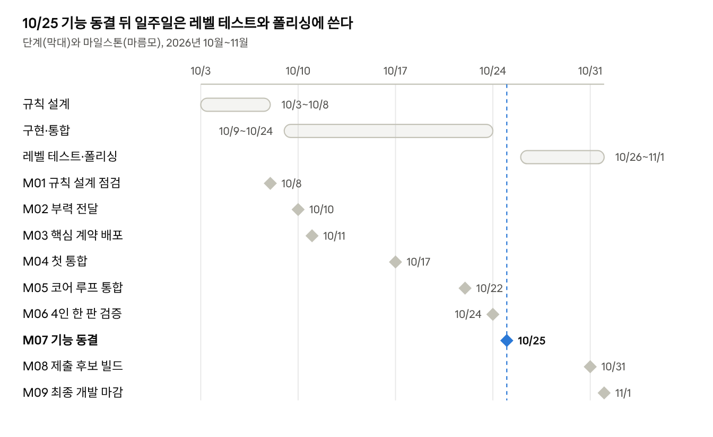

# 제공된 게임 기획 v4 원문

사용자 제공 「등대 마피아 기획서 v4.docx」의 본문·표를 2026-10-10 Markdown으로 전사했다. 원본 작성일 2026-10-09. SHA-256 `1614fe87d0a2f535d4ab9019fa31b634208a4a9fc9ae12e09252e275cea6208d`. 원문의 오탈자·가안·미정과 제안을 보존한다. 마지막 그림은 원본에서 추출했다. 페이지 배치는 재현하지 않는다.

사용자 대화에서 확정한 실명 담당과 시스템&UI 최명기 배정은 원본의 미정 표기보다 우선한다. 코드 구현 완료 근거가 아니며 문제별 현행 판정은 [문제 대장](../../07-design-issue-register.md)을 따른다.

등대 마피아 기획서 v4

Oct 9, 2026 · @민서

PC (Unity 3D, URP) · 4인 호스트-클라이언트 (Mirror, 서버 권위) · 게임 디자인 문서 v4 (10/9 업데이트 반영)

v4 변경 요약

v4는 v3(10/7)에 10/8~10/9 결정 사항을 반영했다. 가장 큰 변화는 인게임 보이스·무전 삭제, 네트워크 전담 역할 해체, 판 길이(일수) 조정 가능 구조다.

| 항목 | 변경 내용 | 반영 위치 |
| --- | --- | --- |
| 보이스·무전 | 인게임 보이스 채팅과 배 무전 기능 삭제. v3 10장 삭제 | 1.1, 2.1, 3.1, 9.1, 11 |
| 판 길이 | 전체 일수·낮밤 길이를 설정값 한 곳에서 바꿀 수 있게 함(레벨 테스트용). 기본값은 5일, 낮 5분 + 밤 2분 유지 | 1.2, 2.1, 8.1, 11 |
| 지역 해금 | 해금 시점을 "전체 일수의 1/3·2/3" 비율로 정의. 일수가 바뀌어도 비율 유지 | 8.1 |
| 필수 기능 확정 | 유령선, 특수 기능 섬 3종, 최후 전투 전용 날씨, 부식 모듈 표류·회수 | 12 |
| 모듈 부식 | 부식은 제작 중·완성(미장착) 모듈에만 가능. 장착 후 일정 시간 뒤 바다로 떨어져 표류 → 회수·수리 또는 분해 | 7.4 |
| 날씨·바다 | 날씨 5종(최후 전투 전용 포함), 파도 충격 피해, 토네이도, 구름형 안개, 폭풍벽 정리. v3 10장 자리로 이동 | 10 |
| 표류 잔해 | 난파 화물 잔해와 떨어진 모듈을 같은 픽업 오브젝트로 통일 | 7.4, 9.1 |
| 역할 분담 | 네트워크 전담 해체. 각 기능 담당자가 동기화까지 맡고, 4인 네트워크 테스트를 정기적으로 진행 | 12 |
| 일정 | 마일스톤 M01~M09 정리, 기능 동결 10/25, 최종 마감 11/1 | 12 |
| 심해 게이지 | 마피아의 방해 공작(몬스터 소환, 난파 유도 등)으로 게이지가 차는 규칙 삭제. 숨어 있는 날, 오투표, 의식 실패로만 찬다 | 2.3, 4.5, 4.7 |
| 투표 횟수 | 한 판에 플레이어당 2회로 제한(플레이어 지목 1번 = 1회). 초반에 게임이 끝나는 것을 막기 위함 | 2.1, 4.1, 4.8, 11 |

## 1. 개요

4명의 선원이 각자 배를 몰고 섬을 오가며 자원을 모아 등대를 밝혀야 한다. 그중 한 명은 등대가 켜지는 것을 막으려는 마피아다. 낮에는 바다로 나가 파밍하고 밤 후반에는 모두 등대 섬에 모인다. 크툴루 신화 분위기의 폭풍우 치는 바다 연출이 가장 중요하다.

### 1.1 핵심 구성

플레이어 4명은 각자 직군을 가진다. 그중 1명은 마피아를 겸임한다.

시민은 메인 등대를 활성화해야 하고 마피아는 이를 막아야 한다.

플레이어는 배를 한 척씩 가지고 섬을 오가며 자원을 파밍한다. 파밍한 자원으로 모듈을 크래프팅해 배를 업그레이드하고 등대를 활성화한다.

바다에는 파밍을 방해하는 몬스터가 산다. 배를 몰아 피하거나 배에 달린 대포로 처치한다.

바다 자체도 위협이다. 날씨가 나쁘면 큰 파도와 토네이도가 배를 상하게 한다(10장).

배는 난파될 수 있지만 플레이어는 죽지 않는다. 행동 불능이 되어 동료의 도움이 필요하다.

마피아는 정체가 들키면 등대를 부수는 괴물을 소환할 수 있다. 이후 게임은 최후 전투로 넘어가며 괴물은 낮밤 구분 없이 등대를 계속 파괴한다.

| 영역 | 내용 |
| --- | --- |
| 시점 | 3인칭 |
| 시간 구조 | 하루 단위 낮/밤 사이클(서서히 전환). 밤에도 파밍 가능, 밤 후반에 전원 집결. 전체 일수는 설정값 |
| 바다 | 암초·몬스터·파도 충격·토네이도로 인한 난파 위험. 자연 스폰 + 마피아 소환 몬스터, 대포 전투 |
| 날씨 | 날씨 5종. 마피아는 다음 날 날씨를 바꿀 수 있고, 최후 전투는 전용 날씨로 고정 |
| 마피아 | 들키기 전/후 능력 분리, 바다 몬스터 소환, 환영 섬, 모듈 부식, 날씨 변경, 자원 빼내기 |
| 소환 이후 | 낮밤 구분 없는 최후 전투. 괴물 vs 등대 스피드런 |
| 등대 | 메인 등대 하나(수리도에 따라 버프). 활성화에 공유 모듈 장착 필요 |
| 모듈·크래프팅 | 자원 파밍 → 작업대 크래프팅 → 배(개인) / 등대(공유)에 장착 |
| 맵 | 지역 해금 + 매 판 랜덤 배치 + 특수 기능 섬 |
| 직군 | 패시브 + 액티브 스킬 |

디자인 목표 — 괴물 소환은 압도적으로 강한 카드지만, 마피아의 최우선 목표는 "정체를 들키지 않는 것"이어야 한다. 소환은 들킨 마피아의 탈출구가 아니라 끝까지 숨어 있던 마피아의 마지막 한 수다.

### 1.2 진영과 승리 조건

| 진영 | 인원 | 목표 | 승리 조건 |
| --- | --- | --- | --- |
| 시민 | 3명 | 메인 등대 활성화 | 점화 의식 성공, 또는 최후 전투에서 등대를 지키며 수리 완료 |
| 마피아 | 1명 (직군 겸임) | 등대 활성화 저지 | 기한(마지막 날 밤)까지 등대가 켜지지 않음, 또는 소환한 괴물이 등대를 파괴 |

기한은 "마지막 날(N일차) 밤"이다. N은 설정값이며 기본값은 5일이다. 한 판 30~40분을 기준으로 레벨 테스트에서 일수와 하루 길이를 조정한다. 기한 전에 등대가 활성화되거나 파괴되면 즉시 종료한다.

## 2. 하루 사이클과 전체 흐름

게임은 하루 단위로 진행되며 낮에는 흩어져 파밍하고 밤 후반에는 모두 한 자리에 모인다. 흩어지는 시간은 마피아에게 기회를, 모이는 시간은 시민에게 추리의 시간을 준다.

### 2.1 낮과 밤 (숨은 단계)

낮과 밤은 확 바뀌지 않고 서서히 바뀐다. 시간과 시각 효과를 동시에 보여준다. 낮·밤 길이와 귀항 알림 시각은 설정값이다(기본 낮 5분, 밤 2분, 해 지기 60초 전 알림).

| 구간 | 내용 |
| --- | --- |
| 낮 | 각자 배로 섬을 돌며 파밍. 바다 몬스터 회피·전투. 마피아는 몰래 방해 |
| 해 질 녘 | 귀항 알림. 밤이 되기 전에 등대 섬으로 돌아오는 것이 안전하다 |
| 밤 | 밤에도 파밍 가능. 밤에만 파밍 가능한 자원이 있다. 밤에 랜덤 확률로 유령선이 안개 속에서 떠오르며 마피아에 대한 힌트를 얻을 수 있다 |
| 밤 회의 | 회의 시간은 밤 후반으로 미룬다. 전원 등대 섬에 집결해 토론한다 |

자원은 시간대와 관계없이 언제든 넣을 수 있으며 실시간으로 업데이트된다.

밤에 바다에 남아 있으면 어두워 시야 확보가 어렵고 몬스터가 강해진다. 등대 섬 근처 안전지대만 안전하다.

비밀 투표는 시간대와 관계없이 할 수 있지만 한 판에 2회뿐이다(4.1). 그래서 밤 토론 뒤 언제 표를 쓸지가 중요한 선택이 된다.

인게임 보이스는 삭제되었다. 토론 수단은 13장 결정 필요 목록에 있다.

### 2.2 최후 전투의 시간 (소환 이후)

소환 이후에는 낮 파밍·밤 집결 등의 구분이 없다. 시간 시스템은 따로 계속 진행된다.

괴물은 소환된 후 아침에도 사라지지 않고 계속 등대를 파괴한다.

날씨는 최후 전투 전용 날씨(심연)로 바뀌고 해제되지 않는다. 아침에도 어둡고 으스스하다(10.1).

시민은 수리 자원을 파밍하고 마피아는 바다 몬스터로 파밍을 방해한다.

### 2.3 전체 게임 흐름

마피아가 끝까지 숨으면 점화 의식의 투표가 승부를 가르고, 소환하면 최후 전투에서 등대를 지켜내는지가 승부를 가른다.

숨은 단계: 낮/밤을 반복하며 파밍하고 모듈을 크래프팅해 메인 등대의 수리도를 올린다. 마피아는 직군 능력을 쓰며 몰래 방해하고, 숨어 있는 날이 쌓일수록 심해 게이지가 찬다.

점화 의식: 메인 등대 수리도 100% 도달 후 60초. 시민 과반이 마피아를 찍었어야 성공한다.

분기:

의식 성공 → 시민 승리

마피아가 끝까지 숨고 기한이 끝남 → 마피아 승리

확인에 성공한 마피아가 괴물 소환 → 최후 전투

최후 전투: 낮밤 구분 없이 괴물이 등대를 계속 파괴한다. 시민은 등대를 지키며 수리를 끝내고 점화하면 승리한다. 등대 내구도가 0이 되거나 기한이 끝나면 마피아 승리.

최후 전투의 점화는 투표 조건 없이 수리도만 채우면 된다. 이미 정체가 드러났기 때문이다. 괴물의 힘은 여전히 "심해 게이지 − 봉인"이다(4.5).

## 3. 플레이어

### 3.1 시점과 조작

시점은 3인칭이다.

| 상태 | 조작 대상 | 할 수 있는 것 |
| --- | --- | --- |
| 배를 타고 있을 때 | 배 | 항해, 몬스터 회피(무빙), 배 대포 사격, 표류물·흔적 상호작용 |
| 배에서 내렸을 때 | 캐릭터 | 섬 탐색, 자원 채집, 작업대 사용(모듈 크래프팅), 배·등대 모듈 장착, 배 수리 |

플레이어 1명당 배 1척. 각자 따로 움직이므로 누가 어디에 있었는지가 추리의 근거가 된다.

외부 섬에서 모은 자원은 개인 인벤토리에 담아 등대 섬으로 가져온다.

배 업그레이드는 배 모듈 장착으로 이루어진다(7장).

배는 파도에 따라 흔들린다. 큰 파도에 부딪히면 충격으로 내구도가 깎이고, 바람·해류·토네이도에 밀린다(10장).

### 3.2 스킬 규칙

패시브 스킬: 항시 활성화.

액티브 스킬: 횟수 제한 또는 조건 제한이 필요하다. "하루 1회"처럼 하루 사이클에 맞춘 충전이 자연스럽다.

마피아도 직군을 가지며 들키기 전에는 직군 스킬을 그대로 쓴다. 직군만으로는 마피아를 구분할 수 없어야 한다.

### 3.3 직군 (미확정)

| 직군 | 패시브 | 액티브 (예시) |
| --- | --- | --- |
| 항해사 | 지도에 환영 섬이 뜨지 않는다. 배 속도 상승 | 구조 항로 안내: 난파된 동료까지 최단 경로 표시 (하루 1회) |
| 기술자 | 배 대포 재장전 속도 상승 | 장비 수리·강화 관련 (배 수리 방식 확정 후 결정) |
| 채집가 | 희귀 자원 획득 확률·채집 속도 상승 | 섬에 남은 자원 위치 감지 (하루 1회) |

모듈 부식 확인 스킬: 모듈의 부식 여부를 확인하는 직군 스킬. 하루 1회 사용. 담당 직군은 미정. 결과는 사용한 본인에게만 보인다.

항해사와 환영 섬의 심리전: 항해사는 환영 섬을 폭로할 수 있는 유일한 직군이다. 반대로 마피아가 항해사라면 "그 섬은 진짜다"고 거짓말을 할 수 있다. 항해사를 자칭하는 사람의 말을 얼마나 믿을지가 시민의 고민이 된다.

## 4. 마피아 시스템

마피아는 들키기 전에는 시민처럼 살며 몰래 방해하고, 들킨 뒤에는 직군을 버리고 괴물을 부린다. 두 상태의 도구가 완전히 다르다.

### 4.1 투표와 확인

플레이어는 마피아라고 생각하는 사람에게 비밀 투표할 수 있다. 투표는 한 판에 플레이어당 2회로 제한한다(플레이어를 지목하는 행동 1번이 투표 1회다. 처음 지목하든 다른 사람으로 바꾸든 지목할 때마다 1회를 쓴다). 판 초반에 투표가 몰려 마피아의 확인이 바로 성공하고 게임이 일찍 끝나는 것을 막기 위함이다. 결과는 본인과 시스템만 안다.

마피아는 최대 1~2회 자신의 정체가 들켰는지 확인할 수 있다.

들켰다면(누군가 자신에게 투표) 괴물을 소환할 수 있다. 들키지 않았다면 패널티를 받는다.

### 4.2 들키기 전 / 들킨 후 능력

| 구분 | 들키기 전 (숨은 단계) | 들킨 후 (괴물 소환 이후) |
| --- | --- | --- |
| 직군 스킬 | 패시브·액티브 모두 사용 | 비활성화 |
| 인벤토리 | 사용 가능 | 비활성화 |
| 바다 몬스터 소환 | 가능. 작은 몬스터, 시야 안에 플레이어가 있을 때 지정 소환 가능 | 가능. 이전과 다른 종류의 몬스터, 파밍 방해 |
| 등대 괴물 | 소환 불가 | 등대를 부수는 괴물 소환 |
| 환영 섬 | 시민의 지도에 거짓 섬을 띄움 | 불가 (이미 정체가 드러남) |
| 모듈 부식 | 한 판 1회 | — |
| 날씨 변경 | 다음 날의 날씨를 변경할 수 있다 (횟수 제한) | 불가 (최후 전투 전용 날씨로 고정) |

### 4.3 바다 몬스터 소환 (들키기 전)

항해 중 마피아의 시야에 플레이어가 있으면 몬스터를 더 많이 소환해 그 플레이어의 파밍을 막을 수 있다.

이것이 시민에게는 증거가 된다. "저 사람 근처만 가면 몬스터가 쏟아진다"는 의심이 쌓인다.

들키기 전에는 자연 스폰인지 헷갈리게 아슬아슬하게 조절하고 들킨 뒤에는 공격적으로 쓴다.

소환 몬스터는 자연 스폰 몬스터와 외형이 같다. 한 번의 소환만으로는 티가 나지 않고, 단서는 "빈도"와 "누구 옆에서"로만 남는다.

하루 소환 횟수 또는 쿨다운을 둔다. 무제한이면 숨기보다 파밍 봉쇄가 더 쉬워진다.

### 4.4 환영 섬 (들키기 전)

마피아는 시민 플레이어의 지도에 거짓 정보를 적을 수 있다. 지도에는 있지만 실제로는 없는 섬, 환영 섬이 생긴다.

항해사의 지도에는 환영 섬이 뜨지 않는다(3.3).

환영 섬에 다가가면 섬이 안개처럼 흩어져 사라지고, 주변에 바다 몬스터가 나타나거나 연료·시간만 낭비한다.

환영 섬은 있는 섬을 숨기는 것보다 없는 섬을 더하는 방식으로 제한한다. 하루 1개 등 횟수 제한도 둔다.

환영 섬은 대상 플레이어의 화면에만 존재한다. 다른 플레이어에게는 정보가 전혀 전달되지 않는다.

### 4.5 심해 게이지와 봉인

괴물의 힘 = 심해 게이지 − 봉인. 들키는 것이 마피아에게 보상이고 투표가 시민에게 손해인 구조를 이 두 장치로 바로잡는다.

| 장치 | 내용 |
| --- | --- |
| 심해 게이지 | 숨어 있는 날이 쌓일수록 찬다. 오투표 페널티와 의식 실패로도 찬다. 방해 공작(몬스터 소환, 난파 유도 등)으로는 차지 않는다 |
| 봉인 | 마피아에게 투표한 상태가 유지되는 동안 그 시민의 봉인이 쌓인다. 같은 대상에 연속 투표한 시간만 인정된다 |
| 오투표 페널티 | 무고한 사람에게 투표해 두면 그 시간만큼 심해 게이지가 찬다 |
| 점화 의식 | 등대 수리 완료 후 60초. 시민 과반(2명 이상)이 마피아에게 투표한 상태여야 성공. 실패 시 심해 게이지가 크게 찬다 |

오투표 페널티가 필요한 근거: 시민 3명이 무작위로 찍기만 해도 1명 이상이 마피아를 찍을 확률이 1 − (2/3)³ ≈ 70%다. 페널티가 없으면 마피아의 확인이 거의 항상 성공한다.

### 4.6 확인 실패와 소진

확인 실패 = 시민에게 단서: "바다가 누군가를 불렀으나 응답이 없었다" 전체 공지 + 무고한 시민 1명 공개. 용의자가 3명에서 2명으로 줄어든다.

2회 모두 실패 = 심해의 문이 닫힌다: 괴물 소환이 영구 불가. 마피아는 숨은 채 의식을 실패시키는 길로만 이길 수 있다.

### 4.7 숨어서 하는 방해

모두 무고한 실수처럼 보일 수 있어야 한다. 방해에 성공해도 심해 게이지는 차지 않는다. 방해의 목적은 등대 수리를 늦추는 것이다.

바다 몬스터 소환(4.3), 환영 섬(4.4)

등대에 장착할 모듈 부식시키기: 한 판 1회(7.4)

난파된 동료를 늦게 구조하거나 떠다니는 잔해·모듈을 몰래 챙기기

작업대에 투입된 자원을 빼내기 (인출은 서버에 기록되어 단서로 쓸 수 있다)

다음 날 날씨를 변경 (날씨 예측소의 예보와 실제 날씨가 달라져 단서가 된다, 8.4)

### 4.8 허점과 보완

| 허점 | 보완 |
| --- | --- |
| 확인 성공 후 소환을 미뤄 게이지를 키움 | 확인 성공 시 10초 안에 소환 여부 결정, 확인 기회는 소모 |
| 투표를 바꿨다 돌리며 확인 타이밍을 피함 | 봉인은 같은 대상 연속 투표 시간만 인정, 바꾸면 초기화. 투표 2회 제한으로 반복 변경 자체가 어렵다 |
| 투표하는 모습이 정보가 됨 | 단축키 메뉴로 1초 안에, 화면 연출 없이 처리 |
| 마피아도 투표해야 하나? | 가능하게 둔다. 투표 행동만으로는 구분 불가 |
| "들킴"을 1표로 판정하면 너무 쉬움 | 1표로 시작, 테스트 후 2표로 조정 가능하게 설계 |
| 소환 후 시민이 일방적으로 짐 | 괴물 힘 = 게이지 − 봉인. 소환 순간 시민에게 짧은 결속 버프도 고려 |
| 난파 중인 플레이어의 투표 | 행동 불능 중에도 투표 가능. 구조 대기가 추리 시간이 된다 |
| 패킷을 열어 마피아를 알아냄 | 비밀 정보(직군·마피아, 소환 여부, 부식 여부, 미래 날씨, 환영 섬 대상)는 당사자에게만 보내고 모두에게 보내는 상태에 넣지 않는다 |

마피아의 최선 전략 — 끝까지 숨어서 게이지를 최대로 모았다가, 시민들이 확신하고 투표한 의식 직전에 확인하고 터뜨리는 것. 단, 숨어 있는 동안 바다 몬스터를 너무 많이 쓰면 스스로 증거를 남긴다.

## 5. 몬스터

몬스터는 바다에만 살며 역할은 자원 파밍 방해와 등대 파괴 두 가지다. 바다 몬스터는 최후에 소환되는 등대 괴물보다 작고 약하다.

### 5.1 몬스터 종류

| 종류 | 출현 방식 | 크기·강도 | 목표 |
| --- | --- | --- | --- |
| 자연 스폰 바다 몬스터 | 바다에 배치된 스포너에서 스폰, 정해진 영역을 패트롤 | 작음. 먼 해역일수록 강함 | 근처 배 공격, 파밍 방해 |
| 소환 바다 몬스터 (들키기 전) | 마피아가 시야 안 플레이어 근처에 소환 | 작음 (자연 스폰과 구분 어렵게) | 특정 플레이어의 파밍 방해 |
| 소환 바다 몬스터 (들킨 후) | 마피아가 소환 | 이전과 다른 종류, 더 공격적 | 최후 전투 중 파밍 방해 |
| 등대 괴물 | 마피아가 정체 들킨 후 소환 | 가장 큼, 힘 = 심해 게이지 − 봉인 | 낮밤 구분 없이 메인 등대를 계속 파괴 |

스포너 배치: 맵이 "어디에, 어떤 등급의" 스포너를 둘지 정하고, 적 시스템이 "언제, 무엇을" 스폰할지 정한다. 스포너 위치는 비밀이다.

멀리 갈수록 강하다: 구역별로 강한 스포너를 더 많이 두고, 같은 구역 안에서도 등대에서 멀수록 등급을 올린다. 등대 섬 안전지대에는 스포너가 없다.

### 5.2 플레이어의 대응

회피: 배를 몰아 무빙으로 피한다.

전투: 배에 장착된 대포로 공격해 죽일 수 있다.

몬스터에게 당하면 배 내구도가 깎이고 0이 되면 난파(9장)된다.

### 5.3 몬스터 AI

| AI 상태 | 바다 몬스터 | 등대 괴물 |
| --- | --- | --- |
| 대기·순찰 | 정해진 영역을 패트롤 (자연 스폰) | 없음. 소환 후 아침에도 사라지지 않는다 |
| 추적 | 감지 범위에 들어온 배를 쁗는다 | 등대 섬으로 접근 |
| 공격 | 배에 돌진·물어뜯기 등 | 메인 등대를 우선 공격, 방해하는 플레이어는 부차 목표 |
| 이탈 | 추적 범위를 벗어나거나 섬 안에 들어가면 포기 | 없음. 해가 떠도 물러나지 않고 계속 파괴 |

모든 몬스터 AI는 호스트에서만 판정한다. 소환 몬스터인지 자연 스폰인지는 클라이언트에 보내지 않는다.

## 6. 등대

등대는 메인 등대 한 종류이며 승리 조건이 된다. 보조 등대는 삭제되었다.

| 구분 | 메인 등대 |
| --- | --- |
| 역할 | 활성화해야 하는 등대 (승리 조건) |
| 자원 | 수리 자원을 투입해 수리도를 올린다. 자원은 언제든 넣을 수 있고 실시간으로 업데이트된다 |
| 모듈 | 등대 활성화에는 몇 가지 모듈 장착이 필요하다. 등대 활성화 모듈은 공유한다(7장). 장착한 모듈은 손으로 떼어낼 수 없다 |
| 효과 | 수리도에 따라 플레이어 능력치 향상 등 시민에게 긍정적 영향 |
| 불빛 | 불빛은 마지막에 켜지고 게임이 끝난다 |
| 위협 | 최후 전투에서 등대 괴물의 표적. 이때 내구도는 수리도와 별개 |

### 6.1 메인 등대 수리도 보상

수리도 구간마다 시민 전체에게 보상을 주어, 등대가 "끝에만 의미 있는 게이지"가 아니라 매일 투자할 이유가 되게 한다.

| 수리도 | 보상 (예시) |
| --- | --- |
| 25% | 배 이동 속도 상승 |
| 50% | 자원 파밍량 증가 |
| 75% | 배 대포 피해 상승 |
| 100% | 점화 의식 가능 (4.5) |

마피아도 들키기 전에는 이 보상을 받는다. 들킨 뒤에는 받지 못한다.

최후 전투에서는 등대 괴물의 공격으로 내구도가 깎이며, 수리도가 높을수록 내구도도 높다.

## 7. 모듈과 크래프팅

배 업그레이드와 등대 활성화에는 몇 가지 모듈 장착이 필요하다. 장착할 모듈은 플레이어들이 자원을 파밍하고 크래프팅해서 얻는다.

### 7.1 모듈이 필요한 곳

| 대상 | 용도 | 소유 |
| --- | --- | --- |
| 배 | 배 업그레이드 | 개인 (개별) |
| 메인 등대 | 등대 활성화 | 공유 |

### 7.2 크래프팅 흐름

자원 파밍

작업대에서 메뉴를 열고 원하는 모듈 선택

자원 집어넣기

자원 할당량 실시간 업데이트

모듈 완성

배 / 등대에 모듈 장착

자원은 언제든 넣을 수 있다. 투입 현황은 실시간으로 업데이트된다. 투입·인출은 모두 서버가 확인하고 기록한다.

### 7.3 개인 모듈과 공유 모듈

배 업그레이드 모듈: 개별. 각자 자기 배를 위해 크래프팅한다.

등대 활성화 모듈: 공유. 모두가 함께 만든다.

### 7.4 모듈 부식

부식된 모듈은 장착된 뒤 일정 시간이 지나면 바다로 떨어져 표류한다. 누구나 건져서 수리하면 다시 쓸 수 있고, 놓치면 분해된다.

| 항목 | 내용 |
| --- | --- |
| 마피아 부식 | 등대에 장착할 모듈을 부식시킨다. 한 판 1회. 제작 중이거나 완성됐지만 아직 장착하지 않은 모듈에만 가능하다. 제작 중에 부식되면 완성한 모듈에 그대로 이어진다 |
| 부식 여부 확인 | 직군 스킬로 확인. 하루 1회 (담당 직군 미정, 3.3). 결과는 사용자만 안다 |
| 낙하 | 부식 모듈이 장착되면 낙하 타이머가 시작된다. 떨어지기 전에는 누구도 떼어낼 수 없다. 낙하 시점은 미정(장착 후 2~5분 랜덤 / 다음 날 아침) |
| 표류·회수 | 떨어진 모듈은 파도에 떠밀려 다닌다. 누구나 건질 수 있고, 작업대에서 수리하면 부식이 풀려 다시 장착할 수 있다 |
| 분해 | 일정 시간 안에 회수하지 못하면 분해된다. 결과는 미정(일부 자원 드롭 / 완전 소멸) |

부식이 추리에 주는 것: 누가 그 모듈을 만들고 장착했는지, 떨어진 모듈을 누가 건졌는지가 의심의 근거가 된다.

## 8. 맵

맵은 매 판 랜덤으로 생성되고 일차가 지날수록 범위가 넓어진다. 멀리 갈수록 자원은 좋아지고 위험도 커진다.

### 8.1 지역 해금

진행에 따라 갈 수 있는 범위가 넓어진다. 해금 기준은 "전체 일수 대비 비율"이다. 일수를 바꿔도 1/3·2/3 지점이 유지된다(5일 기준 2일차·4일차).

가까운 섬은 희귀도 낮은 자원을 적게, 먼 섬은 희귀 자원과 많은 양의 일반 자원을 준다.

잠긴 구역의 경계는 투명 벽이 아니라 폭풍벽으로 막는다. 벽 안쪽은 파도가 급격히 높아지고 번개가 치며 배를 바깥으로 밀어낸다.

| 구역 | 해금 시점 | 자원 | 위험 |
| --- | --- | --- | --- |
| 내해 | 처음부터 | 일반 자원, 적은 양 | 자연 스폰 몬스터 적음 |
| 중간 해역 | 전체 일수의 1/3 | 일반 자원 많음, 희귀 자원 일부 | 암초, 몬스터 증가 |
| 외해 | 전체 일수의 2/3 | 희귀 자원 | 몬스터 다수, 귀항 거리가 멀어 밤에 돌아오기 힘듦 |

### 8.2 랜덤 생성

매 판 섬, 난파선 등 미리 만들어둔 프리팹을 랜덤 위치에 배치한다. 섬끼리 너무 가깝거나 몰리지 않게 간격을 둔다.

등대 섬은 항상 중앙 고정. 구역별로 섬 수와 종류의 최소·최대를 정해 판마다 편차가 너무 크지 않게 한다.

맵이 매번 달라서 환영 섬(4.4)이 힘을 갖는다. 지도를 외울 수 없으니 거짓 섬을 가려낼 방법이 항해사와 직접 확인뿐이다.

같은 판에서는 모든 플레이어가 같은 맵을 본다. 서버가 정한 시드 하나로 각자 같은 맵을 만든다.

### 8.3 섬 종류

| 장소 | 역할 |
| --- | --- |
| 등대 섬 | 메인 등대와 작업대가 있는 중심 거점. 밤 회의 집결 장소이자 안전지대 |
| 자원 섬 | 섬마다 나오는 자원 종류/생산량이 다르다(목재, 석재, 금속, 연료 등). 기본 자원은 대부분의 자원 섬에서 얻는다. 하루가 지나면 매장량이 전체 리셋되지 않고 일부만 차오른다 |
| 밤 전용 자원 | 밤에만 파밍 가능한 자원 |
| 난파선 | 랜덤 스폰 포인트. 희귀 자원을 조금씩 얻을 수 있다 |
| 유령선 | 밤에 랜덤 확률로 짙은 안개 속에서 떠오른다. 상호작용한 플레이어만 마피아에 대한 힌트를 얻는다. 근처에 있던 사람만 볼 수 있어 "내가 봤다"는 증언이 다시 신뢰의 문제가 된다 |
| 특수 기능 섬 | 자원 파밍이 아닌 특수 기능을 주는 섬(8.4) |
| 환영 섬 | 마피아가 띄운 거짓 섬. 대상의 화면에만 있고 다가가면 안개처럼 사라진다(4.4) |

### 8.4 특수 기능 섬

| 섬 | 기능 | 추리에 주는 것 |
| --- | --- | --- |
| 레이더 섬 | 모든 배의 위치를 파악. 누구의 배인지는 알 수 없다 | "그때 저 해역에 배가 한 척 있었다"는 정보로 누군가의 말을 검증 |
| 관측소 | 주변 해역의 몬스터 수가 평소보다 많은지 보여줌 | 소환 몬스터가 모인 곳 = 마피아가 다녀간 곳일 수 있다 |
| 날씨 예측소 | 내일의 날씨를 예측할 수 있다 | 마피아가 날씨를 바꾸면 확인한 날씨와 다를 수 있다 |

특수 섬 기능은 하루 횟수를 제한하고 한 번에 한 사람만 쓸 수 있게 한다. 결과는 사용한 사람만 본다. "누가 레이더를 봤는가"가 다시 신뢰의 문제가 된다.

## 9. 난파·구조와 추리 단서

시민이 마피아를 찾는 근거는 "누가 언제 어디에 있었나"다. 흔적, 몬스터 출현 패턴, 난파와 구조가 모두 이 질문에 답하는 정보다.

### 9.1 난파와 행동 불능

배는 바다에서 난파될 수 있다. 원인은 바다 몬스터, 암초, 큰 파도의 충격, 토네이도 등이다.

플레이어는 죽지 않는다. 행동 불능 상태가 되어 동료의 도움을 받아야 한다.

파괴된 배를 수리하려면 자원이 필요하다.

| 항목 | 내용 |
| --- | --- |
| 화물 손실 | 난파 시 개인 인벤토리 일부가 바다에 떠다니는 잔해가 된다. 누구나 건질 수 있다. 떨어진 부식 모듈과 같은 방식으로 파도에 떠다닌다 |
| 행동 불능 상태 | 잔해 위에서 표류. 조명탄 발사(위치 표시), 비밀 투표만 가능 |
| 구조 | 동료가 배를 몰고 와서 일정 시간 상호작용하면 구조 |
| 자동 구조 (안전장치) | 일정 시간(예: 90초) 아무도 오지 않으면 가까운 섬으로 떠밀려가 자력 복귀 |

자동 구조의 무분별한 사용을 막기 위해 공동 자원을 소모하는 방향으로 제한한다. 무전이 삭제되어 구조 요청은 조명탄으로만 한다.

난파가 마피아 게임에 주는 것 — 누가 구조하러 갔는지, 누가 일부러 늦게 갔는지, 잔해를 누가 챙겼는지가 모두 의심의 근거다. 난파 직전에 누가 근처에 있었는지도 소환 몬스터와 연결된다.

### 9.2 의심 증거 정리

| 단서 | 어디서 오나 | 마피아의 대응 |
| --- | --- | --- |
| 특정 사람 주변에 몬스터가 자주 나타남 | 바다 몬스터 소환(4.3), 관측소(8.4) | 소환을 아끼거나 멀리서 쓰기 |
| 지도에 없는 섬을 본 사람과 못 본 사람 | 환영 섬(4.4), 항해사 | 항해사를 사칭하거나 항해사의 말을 의심하게 만들기 |
| 예보와 다른 날씨 | 날씨 변경(4.7), 날씨 예측소(8.4) | 예측소를 쓴 사람의 말을 의심하게 만들기 |
| 밤 집결에 늦음 | 하루 사이클(2.1) | 외해 파밍 핑계 |
| 이동 경로 | 목격, 레이더 섬(8.4) | 다른 사람 경로와 겹치게 움직이기 |
| 난파 구조 지연, 잔해·모듈 챙기기 | 난파(9.1), 모듈 부식(7.4) | 먼저 구조하러 가서 신뢰 쌓기 |
| 유령선 힌트 | 유령선(8.3) | 힌트를 본 사람의 증언을 반박하거나 대신 힌트를 본 척하기 |

## 10. 날씨와 바다 환경

폭풍우 치는 바다는 분위기이자 위협이다. 날씨가 나빠질수록 파도가 커지고 시야가 좁아지며 배가 다칠 일이 늘어난다. (v3의 10장 보이스 채팅은 삭제되었다.)

### 10.1 날씨 종류

| 날씨 | 바다 | 하늘·연출 | 게임에 주는 영향 |
| --- | --- | --- | --- |
| 잔잔 | 낮은 너울, 잔물결 | 맑음, 엷은 해무 | 기본 |
| 흐림 | 너울 증가 | 낮은 구름, 회녹색 톤 | 시야 약간 감소 |
| 비 | 파고 중간, 흰 파도 시작 | 빗줄기, 수면 빗방울 | 시야 감소 |
| 폭풍우 | 큰 너울 + 부서지는 파도, 물보라 | 번개, 짙은 안개, 천둥 | 배가 크게 흔들림, 파도 충격 피해, 토네이도 발생 가능 |
| 심연 | 비정상적인 거대 너울, 거대 파도 | 녹색 번개, 낮에도 어두움 | 최후 전투 전용. 한 번 바뀌면 해제되지 않는다 |

날씨는 확 바뀌지 않고 서서히 바뀐다.

날씨 일정은 판이 시작할 때 전체 일수만큼 미리 정해진다. 플레이어는 날씨 예측소(8.4)에서 내일 날씨만 볼 수 있다.

마피아의 날씨 변경(4.2)은 다음 날 예보를 덮어쓴다. 예측소에서 본 날씨와 실제 날씨가 다르면 단서가 된다. 예측소가 본래 예보와 바뀐 예보 중 무엇을 보여줄지는 13장 결정 필요 목록에 있다.

환영 섬, 유령선, 폭풍벽은 같은 안개 표현을 쓴다.

### 10.2 파도와 배

배는 실제 파도 높이에 따라 뜨고 흔들린다. 모든 플레이어에게 같은 파도가 보인다.

파도 충격: 배가 큰 파도에 세게 부딪히면 내구도가 깎인다. 잔잔한 날에는 피해가 없고, 폭풍우·거대 파도·토네이도 근처에서만 생긴다.

바람과 해류가 배를 밀어낸다. 바람의 세기는 날씨를 따른다.

### 10.3 토네이도 (일반 우선순위)

폭풍우 이상일 때 가끔 발생한다. 등대 섬 안전지대에는 생기지 않는다.

물기둥이 솟아오르며 경고 → 이동하며 배를 빨아들임 → 약해지며 소멸.

중심에 들어가면 배가 크게 손상된다.

### 10.4 구름형 안개

안개는 화면 전체에 씌우는 효과가 아니라 바다 위에 실제로 떠 있는 구름 덩어리다. 배가 안개 속으로 들어가고, 안개 너머에서 배·유령선이 드러난다.

날씨가 나쁘면 짙고 낮게, 맑은 날에는 엷은 해무만 남는다. 바람 방향으로 천천히 흘러간다.

### 10.5 거대 파도 (여유 우선순위)

폭풍우·심연에서 갑자기 큰 파도가 몰려오는 연출. 파도 충격 피해를 줄 수 있다.

일정이 모자라면 토네이도와 함께 가장 먼저 빠지는 기능이다.

## 11. 수치 가안

모두 플레이테스트로 조정할 초기값이다. 판 길이 관련 값(일수, 낮·밤 길이, 귀항 알림, 해금 비율)은 설정값 한 곳에서 바꾼다.

| 항목 | 가안 | 비고 |
| --- | --- | --- |
| 한 판 길이 | 30~40분 |  |
| 전체 일수 (기한) | 5일 | 설정값. 레벨 테스트에서 조정. 마피아의 버티기 승리 기준 |
| 하루 길이 | 낮 5분 + 밤 2분 | 설정값. 밤 회의는 밤 후반으로 미룸 |
| 귀항 알림 | 해 지기 60초 전 | 설정값 |
| 지역 해금 | 전체 일수의 1/3, 2/3 | 설정값. 5일 기준 2일차·4일차 |
| 마피아 확인 횟수 | 2회 | 팀 기획상 1~2회 |
| "들킴" 판정 기준 | 1표 이상 | 너무 쉬우면 2표 |
| 확인 성공 후 소환 결정 시간 | 10초 |  |
| 점화 의식 | 60초, 시민 2명 이상 마피아 투표 | 최후 전투에서는 투표 조건 없음 |
| 들키기 전 바다 몬스터 소환 | 하루 3회 또는 쿨다운 90초 |  |
| 환영 섬 | 하루 1개 |  |
| 마피아 모듈 부식 | 한 판 1회 |  |
| 모듈 부식 확인 직군 스킬 | 하루 1회 | 담당 직군 미정 |
| 부식 모듈 낙하 시점 | 장착 후 2~5분 또는 다음 날 아침 | 미정 |
| 특수 기능 섬 사용 | 하루 횟수 제한, 동시 1인 | 횟수 미정 |
| 흔적 상호작용 | 하루 1인 1~2회 |  |
| 자동 구조 시간 | 90초 |  |
| 자원 섬 매장량 회복 | 하루마다 일부 회복 | 회복량 미정 |
| 심해 게이지 / 봉인 충전 속도 | 미정 | 밸런스 시뮬레이션으로 결정 |
| 비밀 투표 | 한 판에 플레이어당 2회 | 플레이어를 지목하는 행동 1번 = 1회 (다른 사람으로 바꾸는 지목도 1회) |

## 12. 역할 분담과 일정

네트워크 전담 역할은 없어졌다. 각 기능 담당자가 자기 기능의 서버 동기화까지 맡고, 정기 4인 네트워크 테스트(10/13, 10/16, 10/21, 10/24, 10/26~27)로 안정성을 확인한다. 기능 동결은 10/25, 최종 마감은 11/1이다.

### 12.1 담당 범위

| 담당 | 맡는 기능 | 직접 맡는 동기화 |
| --- | --- | --- |
| 맵·오브젝트·환경 | 바다(파도·부력), 날씨·시간, 안개, 맵 생성·섬·지역 해금, 파밍 오브젝트·매장량, 스포너 배치, 특수 기능 섬 3종, 유령선 등장·경로·연출, 환영 섬, 토네이도, 표류 잔해 | 월드 상태(시드·일차·날씨), 섬 매장량, 토네이도·유령선, 표류 잔해 |
| 상호작용·작업대·등대·공용 기반 | 상호작용 경로(요청 검증·기록), 작업대, 모듈 수명·부식 낙하, 메인 등대, 유령선 힌트 생성, 접속·로비·스폰·재접속, 4인 테스트 주관 | 작업대 투입 현황, 등대 상태, 모듈 |
| 플레이어 | 배 조작·내구도, 직군, 인벤토리, 채집 행동, 대포, 난파·조명탄·구조, 모듈 효과 적용 | 이동, 탑승, 채집, 인벤토리, 대포, 난파 |
| 적·투표 | 몬스터 AI, 스폰 실행, 마피아 소환, 등대 괴물, 비밀 투표, 심해 게이지·봉인 | 몬스터, 투표, 게이지 |
| 시스템·UI (미정) | 공통 상태, 게임 상태 머신, 확인 단서·기회 소진, 의식 승패·최후 전투 통합, HUD, 지도 UI | 게임 단계·승패 |

스포너는 맵이 배치하고 적이 실행한다. 파밍은 맵이 "얼마나 있나", 플레이어가 "얼마나 캐나"를 맡는다.

유령선은 맵이 등장·경로·연출을, 상호작용 담당이 힌트 내용을 맡는다.

비밀 정보는 어느 담당이든 당사자에게만 보낸다(4.8).

### 12.2 마일스톤

일감별 일정과 담당은 팀 일정표(간트 시트)를 따른다.

마일스톤 일정 · 단계 3개, 마일스톤 9개

설계는 10/8에 끝났고, 10/11 핵심 계약 배포부터 10/24 4인 한 판 검증까지 다섯 번의 통합 점검이 이어진다.

## 13. 결정 필요 목록

아래는 아직 정하지 않은 것들이다. 위쪽일수록 다른 일감이 많이 기대고 있어 먼저 정해야 한다.

| 항목 | 선택지 / 현재 안 | 관련 |
| --- | --- | --- |
| 시스템·UI 담당 | 게임 상태 머신, 확인 단서·기회 소진, 의식 승패·최후 전투 통합, HUD, 지도 UI의 담당자 미정. 승패 판정은 10/24 전에 필요 | 12.1 |
| 밤 회의 토론 수단 | 인게임 보이스 삭제 후 토론을 어떻게 할지 (예: 외부 음성 채팅, 텍스트 채팅) | 2.1 |
| 모듈 부식 확인 스킬 담당 직군 | 항해사 / 기술자 / 채집가 중 하나 | 3.3, 7.4 |
| 부식 모듈 낙하 시점 | 장착 후 2~5분 랜덤 / 다음 날 아침 | 7.4 |
| 분해 결과 | 일부 자원 드롭 / 완전 소멸 | 7.4 |
| 날씨 예측소가 보여주는 예보 | 마피아가 바꾸기 전 예보 / 바뀐 예보 | 8.4, 10.1 |
| 배 물리 권한 | 배 주인 클라이언트 / 서버 | 10.2 |
| 파도 충격 피해 | 피해가 시작되는 세기와 내구도 환산 | 10.2 |
| 매장량 | 섬 종류별 자원표, 하루 회복량 | 8.3 |
| 몬스터 스폰 | 스포너 활성 반경, 재스폰 규칙, 등급 구분 | 5.1 |
| 맵 크기 | 낮 시간 안에 갈 수 있는 항해 거리 기준 | 8.2 |
| 특수 기능 섬 사용 횟수 | 하루 몇 회인지 | 8.4 |
| 자동 구조 비용 | 공동 자원을 얼마나, 어떻게 소모할지 | 9.1 |
| 심해 게이지 / 봉인 충전 속도 | 밸런스 시뮬레이션으로 결정 | 4.5 |

## 원본 마일스톤 그림

그림 확인: M01 10/8, M02 10/10, M03 10/11, M04 10/17, M05 10/22, M06 10/24, M07 10/25, M08 10/31, M09 11/1. 원본의 2026년 일정이며 실제 달성 상태를 뜻하지 않는다.
